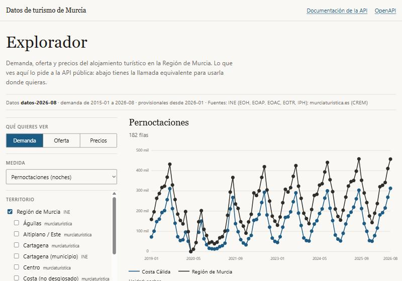

# Datos de turismo de Murcia · API y explorador

[](https://github.com/marnau74/murcia-datos-api/actions/workflows/ci.yml)
[](LICENSE)

API pública y explorador web de la **demanda, la oferta y los precios del alojamiento turístico en la Región
de Murcia** (INE y murciaturistica.es). Es la capa de servicio de
[`murcia-open-data`](https://github.com/marnau74/murcia-open-data): Python y dbt producen cada mes los datos
y este proyecto, en .NET, los sirve.



- **Una petición y ya:** `GET`, sin claves, JSON o CSV (también para Excel). Pandas, `curl` o Power Query.
- **Datos que no mienten:** un mes sin dato es `null` y nunca 0; los totales no suman partes; cada periodo
  agregado dice cuántos meses lleva; lo provisional va marcado ([ADR 0004](docs/adr/0004-semantica-de-los-datos.md)).
- **Se actualiza sola, sin cortes:** descarga la release mensual, verifica sumas y contrato y cambia de versión
  de forma atómica; si algo falla, sigue sirviendo la anterior.
- **Rápida y medida:** p95 de 9 ms con la caché caliente y de 16 ms sin ella ([cómo se midió](docs/adr/0007-rendimiento-y-medidas.md)).
- **Explorador incluido:** filtros, gráfica, tabla, URL compartible y la llamada equivalente lista para copiar.

## Probarla

```bash
API=https://<tu-servidor>

curl -s "$API/v1/metadatos"
curl -s "$API/v1/demanda?territorio=region-murcia&tipo=hotel&residencia=total&agregacion=anio&medidas=pernoctaciones"
```

```json
{
  "datos": [
    { "periodo": "2024", "territorio": "region-murcia", "tipo": "hotel", "residencia": "total", "fuente": "INE",
      "meses": 12, "provisional": false, "pernoctaciones": 3440927 }
  ],
  "meta": { "version_datos": "datos-2026-08", "provisional_desde": "2026-01", "agregacion": "anio", "total_filas": 1 }
}
```

Con pandas o Excel:

```python
import pandas as pd
df = pd.read_csv("https://<tu-servidor>/v1/demanda?territorio=region-murcia&tipo=hotel&residencia=total&formato=csv")
```

En Excel: *Datos → Obtener datos → Desde web* con la URL del CSV (`&excel=true` para punto y coma y decimales con coma).

## La API

| Ruta | Qué devuelve |
|---|---|
| `/v1/metadatos` | Versión de los datos, periodo, fuentes, licencia y los controles de calidad pasados |
| `/v1/territorios`, `/v1/tipos-alojamiento`, `/v1/residencias`, `/v1/medidas` | Catálogos, con los recursos para los que hay datos |
| `/v1/demanda` | Viajeros y pernoctaciones (se **suman** al agregar) |
| `/v1/oferta` | Establecimientos, plazas, ocupación y empleo (se **promedian**) |
| `/v1/precios` | Índice de precios hoteleros y variación interanual (solo mensual) |
| `/v1/indicadores/estacionalidad` | Perfil estacional y relación agosto/enero |
| `/v1/indicadores/variacion` | Variación frente al año anterior y frente a 2019 |
| `/scalar`, `/openapi/v1.json` | Documentación interactiva y contrato OpenAPI |

Filtros comunes: `territorio`, `tipo`, `residencia` (demanda), `desde`, `hasta` (`AAAA-MM`), `agregacion`
(`mes`, `trimestre`, `anio`), `medidas`, `formato` (`json`, `csv`). Cualquier valor desconocido da un 400 que
enumera los permitidos. Más: caché con `ETag`/`If-None-Match`, límite por IP con cabeceras `RateLimit-*`,
CORS abierto solo para lectura.

## Decisiones de diseño

Las decisiones importantes están en [`docs/adr`](docs/adr/README.md). Las que más cuentan:

- **Instantáneas inmutables de DuckDB** abiertas en solo lectura, con préstamo y cambio atómico: una consulta
  en curso termina con la versión con la que empezó ([0002](docs/adr/0002-instantaneas-inmutables-de-duckdb.md)).
- **El contrato entre proyectos se comprueba, no se supone:** sumas SHA-256, versión del contrato, esquema real,
  filas, claves únicas e integridad referencial; si falla, la versión se rechaza ([0003](docs/adr/0003-contrato-y-controles-al-cargar.md)).
- **Medir antes de optimizar:** una consulta de 30 ms pasó a 6 ms limitando DuckDB a dos hilos, porque con tan
  pocos datos repartir el trabajo costaba más que hacerlo ([0007](docs/adr/0007-rendimiento-y-medidas.md)).
- **Política de contenido sin `unsafe-inline`:** la API calcula el hash del `importmap` de Blazor al arrancar
  ([0008](docs/adr/0008-explorador-blazor-y-politica-de-contenido.md)).

## Calidad

252 tests (`dotnet run --project tests/<proyecto>` por cada uno): datos con servidores y ficheros reales,
la API entera en memoria (caché, 304, límites con reloj falso, CORS, CSV, contrato OpenAPI guardado en el
repositorio y comparado) y el explorador con `bUnit`. Los datos de los tests son **ficticios y deterministas**,
con una fórmula que los propios tests conocen, para poder comprobar cada cifra.

La CI (formato, avisos como errores, vulnerabilidades, CodeQL) construye además la imagen y la arranca. Un
trabajo mensual la prueba contra la última release de datos publicada de verdad.

## Cómo ejecutarlo

Requiere el SDK de .NET 10. Con `murcia-open-data` clonado al lado y su `release/` generada:

```bash
dotnet run --project src/MurciaDatos.Api --launch-profile local     # http://localhost:5280
```

o con Docker:

```bash
docker build -t murcia-datos-api .
docker run -p 8080:8080 murcia-datos-api                              # descarga la última release de GitHub
```

Pruebas, rendimiento y despliegue:

```bash
for p in tests/*.Tests; do dotnet run --project "$p" -c Release; done
dotnet run -c Release --project bench/MurciaDatos.Benchmarks           # BenchmarkDotNet
k6 run -e BASE_URL=http://localhost:5280 perf/k6.js                    # con Limites__PeticionesPorVentana alto
```

La guía de despliegue (Render y VPS con Caddy) está en [`docs/despliegue.md`](docs/despliegue.md).

## Límites conocidos

- La descarga contra la API de GitHub real no se ha probado de extremo a extremo (sí con un servidor HTTP falso
  y con una carpeta local); lo hace el trabajo `datos-reales` de la CI. Tampoco se han probado Actions, GHCR,
  Render ni un servidor con certificados.
- `SHA256SUMS` viaja en la misma release que los datos: protege de descargas corruptas, no de una release manipulada.
- El límite de peticiones es por instancia.
- El explorador se publica sin AOT (arranque algo más lento); las gráficas son de líneas, sin zoom.
- Las cifras de rendimiento son de un portátil, con k6 en la misma máquina.

## Licencia

Código bajo licencia [MIT](LICENSE). Los datos pertenecen a sus autores (INE, Instituto de Turismo de la
Región de Murcia y CREM); la API publica datos derivados con la atribución correspondiente.
